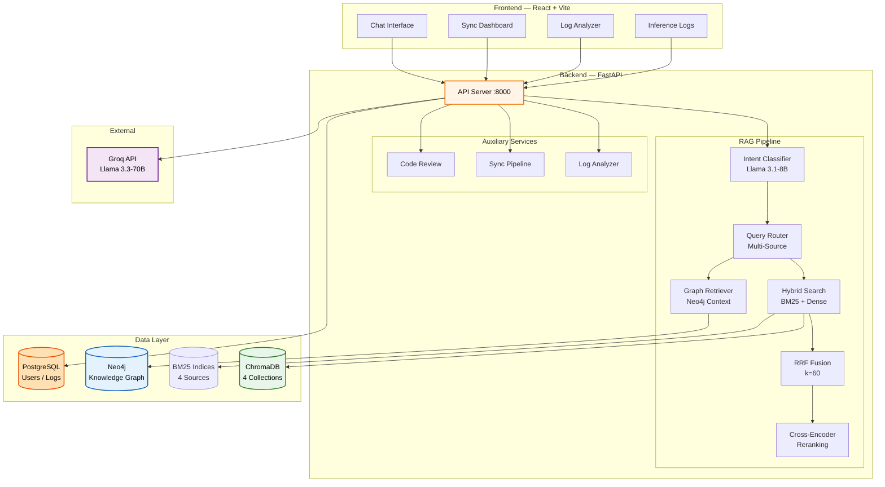
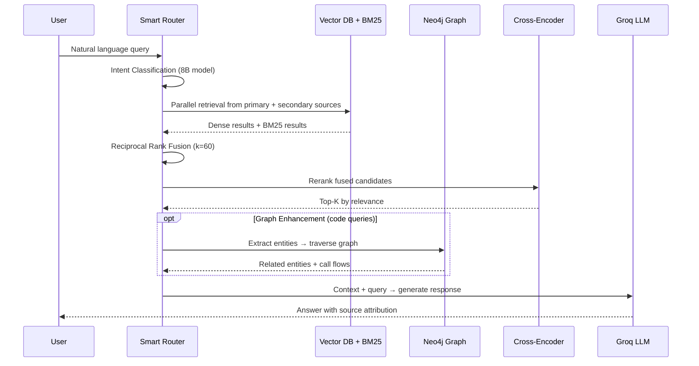
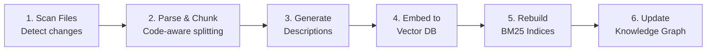
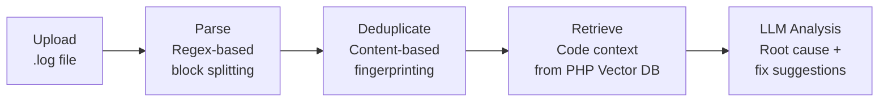

# Banking Knowledge Assistant

<div align="center">

**A Production-Ready Multi-Domain RAG System with Graph-Enhanced Retrieval, Knowledge Sync & Log Analysis**

[](https://www.python.org/)
[](https://fastapi.tiangolo.com/)
[](https://reactjs.org/)
[](https://www.postgresql.org/)
[](https://neo4j.com/)
[](https://www.trychroma.com/)

</div>

---

## Table of Contents

1. [Project Overview](#project-overview)
2. [Architecture](#architecture)
3. [Core RAG Pipeline](#core-rag-pipeline)
4. [Knowledge Base Sync](#knowledge-base-sync)
5. [Log Analyzer](#log-analyzer)
6. [Neo4j Knowledge Graph](#neo4j-knowledge-graph)
7. [Vector Database & Chunking Strategy](#vector-database--chunking-strategy)
8. [Hybrid Search System](#hybrid-search-system)
9. [Authentication & Security](#authentication--security)
10. [Project Structure](#project-structure)
11. [Performance & Metrics](#performance--metrics)
12. [Related Documentation](#related-documentation)

---

## Project Overview

The **Banking Knowledge Assistant** is an enterprise-grade Retrieval-Augmented Generation (RAG) system that provides intelligent query responses across multiple knowledge domains in a banking codebase context. It combines vector search, a knowledge graph, and LLM reasoning to answer questions about business documentation, backend code (PHP/Laravel), frontend code (JavaScript/React), and UI templates (Blade).

### Key Capabilities

| Capability | Description |
|---|---|
| **Multi-Domain RAG** | Query 4 specialized knowledge bases with automatic intent classification |
| **Hybrid Search** | BM25 keyword search + BGE-M3 dense vector search with Reciprocal Rank Fusion |
| **Knowledge Graph** | Neo4j-backed code structure graph with 10 entity types and 12 relationship types |
| **Knowledge Base Sync** | Detect file changes and re-ingest with real-time SSE progress streaming |
| **Log Analyzer** | Parse Laravel logs, deduplicate errors, and produce LLM-powered root cause analysis |
| **Code Review** | AI-powered code review against established coding guidelines |
| **Inference Logging** | Full RAG pipeline observability — routing, retrieval, reranking, and timing metrics |
| **Auth & RBAC** | JWT authentication with bcrypt hashing and role-based access control |

---

## Architecture

### Technology Stack

| Layer | Technology | Purpose |
|---|---|---|
| **Frontend** | React 18, Vite | Chat UI, Log Analyzer UI, Sync dashboard |
| **Backend** | FastAPI, Python 3.8+ | API server, RAG orchestration |
| **Vector DB** | ChromaDB, BGE-M3 (1024d) | Semantic search across 4 knowledge bases |
| **Graph DB** | Neo4j | Code entity relationships and flow traversal |
| **Relational DB** | PostgreSQL | Users, conversations, messages, inference logs |
| **LLM** | Groq API (Llama 3.3-70B) | Response generation, intent classification, log analysis |
| **Reranking** | Cross-Encoder (ms-marco-MiniLM-L-6-v2) | Fine-grained relevance scoring |
| **Search** | BM25 (rank-bm25) + Dense (BGE-M3) | Hybrid keyword + semantic search |

### System Architecture



---

## Core RAG Pipeline

Every query flows through a multi-stage pipeline: classification → retrieval → fusion → reranking → (optional) graph enhancement → LLM generation.

### Query Flow



### Intent Classification

The system uses **Groq function calling** with `llama-3.1-8b-instant` to automatically determine which knowledge sources to query. This eliminates manual context selection.

| Query Example | Primary Source | Secondary Sources |
|---|---|---|
| "What is a term deposit?" | `business_docs` | — |
| "Show me UserController code" | `php_code` | — |
| "Account opening form end-to-end" | `blade_templates` | `php_code`, `business_docs` |
| "KYC verification from UI to backend" | `blade_templates` | `js_code`, `php_code`, `business_docs` |

### Reciprocal Rank Fusion (RRF)

When results come from multiple sources (dense + BM25, or multiple knowledge bases), they are fused using RRF:

```
score(doc) = w_dense × 1/(k + rank_dense) + w_sparse × 1/(k + rank_sparse)
```

| Parameter | Value | Description |
|---|---|---|
| `k` | 60 | RRF constant |
| `w_dense` | 0.6 | Weight for semantic (dense) search |
| `w_sparse` | 0.4 | Weight for keyword (BM25) search |
| Over-fetch multiplier | 2× | Retrieve 2× candidates before reranking |
| Relevance threshold | 2.0 | Minimum cross-encoder score to include |

### Rate Limiting & Resilience

The system handles Groq API constraints with automatic retry, caching, and intelligent fallback:

| Feature | Detail |
|---|---|
| **Retry** | Exponential backoff: 2s → 4s → 8s, max 3 attempts |
| **Caching** | Response cache (30–60 min TTL), ~40% hit rate |
| **Token Tracking** | Daily usage monitoring (100K free tier limit) |
| **Model Fallback** | `70B-versatile` → `8B-instant` when wait > 5 min |

---

## Knowledge Base Sync

**Location:** `backend/routers/sync_routes.py`, `ingestion/ingest_code_file.py`

The sync system detects changes in the codebase and re-ingests only the affected files through the full pipeline — from parsing to graph update — with real-time progress streamed to the frontend via Server-Sent Events (SSE).

### How It Works

1. A JSON **manifest** (`sync_manifest.json`) records `{relative_path: mtime}` for every tracked file
2. On sync trigger, the system scans the `code/` directory and diffs against the manifest
3. Changed files are processed through a 6-step pipeline

### Pipeline Steps



| Step | What Happens | Key Detail |
|---|---|---|
| **Scanning** | Walk `code/` for `.php`, `.js`, `.blade.php` files | Diff against stored manifest |
| **Parsing & Chunking** | AST-based splitting into function/class chunks | Language-aware (PHP, JS, Blade) |
| **Descriptions** | Generate semantic descriptions for chunks | Used for description-first retrieval |
| **Embedding** | Embed chunks with BGE-M3 → upsert to ChromaDB | Per-file incremental updates |
| **BM25 Rebuild** | Rebuild BM25 indices for affected sources | Only touched sources rebuilt |
| **Graph Update** | Re-parse routes, controllers, views → update Neo4j | Full graph rebuild via `build_graph.py` |

---

## Log Analyzer

**Location:** `backend/log_analyzer.py`, `backend/routers/log_analyzer_routes.py`

The Log Analyzer parses Laravel/PHP log files, deduplicates identical errors, retrieves relevant code context from the vector database, and uses the LLM to produce root cause analysis for each unique error.

### Pipeline



### Components

| Component | Class | Responsibility |
|---|---|---|
| **Parser** | `LogParser` | Splits log content into blocks using timestamp anchors, extracts error message, exception class, origin file/line, triggering function, and app-level stack frames |
| **Deduplicator** | `LogDeduplicator` | Groups identical errors using `hash(error_message + origin_file + origin_line)`, tracks occurrence count and first/last seen timestamps |
| **Analyzer** | `LogAnalyzer` | Orchestrates the full pipeline: parse → deduplicate → retrieve code context (via `CodeQueryEngine`) → LLM root cause analysis per unique error |

### Output Per Error

Each analyzed error returns:

- **Error metadata** — exception class, origin file/line, occurrence count, severity hint
- **Code context** — relevant code chunks retrieved from the PHP vector database
- **Root cause analysis** — LLM-generated explanation with fix suggestions
- **Referenced files** — list of code files involved

---

## Neo4j Knowledge Graph

**Location:** `utils/graph_db.py`, `utils/graph_enhanced_retriever.py`, `scripts/build_graph.py`

The knowledge graph maps the structural relationships in the codebase — routes, controllers, models, views, database tables — and is used to **enhance** vector retrieval results with relational context.

### Graph Schema

**Node Types (10):**

| Node | Key Properties | Example |
|---|---|---|
| `Route` | uri, method, middleware | `POST /loans/{id}/approve` |
| `Controller` | name, namespace, file | `LoanController` |
| `HelperClass` | name, file, parent_class | `AccountHelper` |
| `Action` | name, visibility, start_line | `approveLoan` |
| `Model` | name, table, file | `Loan` |
| `BladeView` | name, file | `loan-approval.blade.php` |
| `UIElement` | type, name, html_id | `#approve-btn` |
| `JSFunction` | name, file | `handleApproval` |
| `DBTable` | name | `loans` |
| `DBColumn` | name, type, nullable | `status VARCHAR` |

**Relationship Types (12):**

| Relationship | From → To | Meaning |
|---|---|---|
| `ROUTE_CALLS_ACTION` | Route → Action | HTTP route triggers action |
| `HAS_ACTION` | Controller → Action | Controller defines action |
| `ACTION_LOADS_VIEW` | Action → BladeView | Action renders view |
| `ACTION_USES_MODEL` | Action → Model | Action interacts with model |
| `ACTION_READS_TABLE` | Action → DBTable | Action reads from table |
| `ACTION_WRITES_TABLE` | Action → DBTable | Action writes to table |
| `MODEL_MAPS_TO_TABLE` | Model → DBTable | Eloquent model ↔ table |
| `TABLE_HAS_COLUMN` | DBTable → DBColumn | Table defines column |
| `VIEW_CONTAINS_ELEMENT` | BladeView → UIElement | View has UI element |
| `VIEW_INCLUDES_JS` | BladeView → JSFunction | View includes JS |
| `JS_VALIDATES_ELEMENT` | JSFunction → UIElement | JS validates element |
| `UI_POSTS_TO_ACTION` | UIElement → Action | UI submits to action |

### Graph-Enhanced Retrieval

The `GraphEnhancedRetriever` integrates graph context into the RAG pipeline:

1. **Entity Extraction** — Extract function/class/file names from vector search results
2. **Graph Traversal** — Query Neo4j for related entities (call graphs, route flows, model dependencies)
3. **Score Boosting** — Boost vector results that connect to graph-discovered entities
4. **Context Assembly** — Append a "Code Relationships" section to the LLM prompt

The graph enhancement is applied selectively based on query type (code queries benefit most) and runs with a configurable traversal depth (default: 2 hops).

---

## Vector Database & Chunking Strategy

### Vector Collections

| Collection | Source | Chunks | Embedding | Chunking Strategy |
|---|---|---|---|---|
| `cube_docs_optimized` | Business docs (CUBE) | ~131 | BGE-M3 1024d | Hybrid adaptive (200–1200 chars) with Mermaid diagram conversion |
| `php_code_chunks` | PHP/Laravel backend | ~500+ | BGE-M3 1024d | Function/class-level AST parsing |
| `js_code_knowledge` | JavaScript/React | ~300+ | BGE-M3 1024d | Component/function-level splitting |
| `blade_views_knowledge` | Blade templates | ~50+ | BGE-M3 1024d | Section-based with description enhancement |

### Blade Two-Phase Retrieval (Strategy 2)

Blade templates can be very large (260K+ chars). The system uses a two-phase approach:

1. **Phase 1** — Retrieve 20 candidates by embedding similarity
2. **Phase 2** — Re-rank using cross-encoder on descriptions, select top 5
3. **Smart Snippet Extraction** — Extract only query-relevant sections (~2,000 chars vs 261K original = **99.3% token reduction**)

---

## Hybrid Search System

**Location:** `utils/hybrid_search.py`, `utils/bm25_index.py`

Combines sparse keyword search (BM25) with dense semantic search (BGE-M3). BM25 excels at exact term matching (function names, identifiers), while dense embeddings handle semantic understanding.

### Code-Aware Tokenization

```
"validateKYCDocument" → ["validate", "kyc", "document"]
"validate_kyc_document" → ["validate", "kyc", "document"]
"UserController::createAccount" → ["user", "controller", "create", "account"]
```

### Accuracy Impact

| Query Type | Dense Only | Hybrid (Dense + BM25) | Improvement |
|---|---|---|---|
| Function name queries | ~65% | ~95% | **+30%** |
| Semantic queries | ~90% | ~90% | 0% (no degradation) |
| Mixed (concept + identifier) | ~70% | ~90% | **+20%** |

---

## Authentication & Security

The system implements JWT-based authentication with role-based access control:

| Feature | Implementation |
|---|---|
| **Token** | JWT HS256, 30-min expiry, `sub` claim = user ID |
| **Password** | Bcrypt hashing with automatic salt |
| **Login** | Case-insensitive username, JSON or OAuth2 form |
| **Data Isolation** | All queries filtered by authenticated user ID (from JWT, never from client) |
| **CORS** | Configurable origin whitelist with credentials |

### Roles

| Role | Scope |
|---|---|
| `admin` | Full system access |
| `team_lead` | Team management + all features |
| `team_member` | Standard user access (own data only) |

---

## Project Structure

```
Banking-knowledgeAssistance/
├── backend/
│   ├── main.py                          # FastAPI app, startup, RAG endpoints
│   ├── query_router.py                  # Smart router, intent classifier, RRF fusion
│   ├── log_analyzer.py                  # Log parser, deduplicator, LLM analyzer
│   ├── inference_logger.py              # RAG pipeline logging service
│   ├── auth.py                          # JWT token + bcrypt password utilities
│   ├── models.py                        # SQLAlchemy ORM models
│   ├── database.py                      # PostgreSQL connection + session
│   ├── crud.py                          # Database CRUD operations
│   └── routers/
│       ├── auth_routes.py               # Auth endpoints (signup, login)
│       ├── chat_routes.py               # Chat history CRUD
│       ├── sync_routes.py               # Knowledge base sync (SSE)
│       ├── log_analyzer_routes.py       # Log analysis endpoints
│       ├── inference_logs.py            # Inference log endpoints
│       └── code_review_routes.py        # AI code review endpoint
├── utils/
│   ├── graph_db.py                      # Neo4j connection, schema, query builders
│   ├── graph_enhanced_retriever.py      # Graph-enhanced RAG retrieval
│   ├── hybrid_search.py                 # BM25 + dense search fusion
│   ├── bm25_index.py                    # BM25 index manager
│   ├── groq_rate_limiter.py             # Retry, cache, fallback for Groq API
│   ├── blade_description_engine.py      # Two-phase Blade retrieval
│   ├── smart_snippet_extractor.py       # Query-relevant snippet extraction
│   ├── chunk_cube_docs_optimized.py     # Business doc chunking
│   ├── chunk_php_metadata.py            # PHP code chunking (AST-based)
│   ├── chunk_js_files.py                # JS code chunking
│   └── chunk_views_blade.py             # Blade template chunking
├── embedding_vectordb/                  # Embedding scripts per domain
├── ingestion/
│   └── ingest_code_file.py              # Per-file ingestion (parse → embed)
├── scripts/
│   ├── build_graph.py                   # Build Neo4j graph from parsed code
│   └── build_bm25_indices.py            # Build BM25 indices from ChromaDB
├── parsers/                             # Route, controller, view parsers (for graph)
├── frontend/
│   └── src/
│       ├── ChatApp.jsx                  # Main chat interface
│       └── components/
│           ├── SyncScreen.jsx           # Knowledge sync UI
│           ├── LogAnalyzer.jsx          # Log analyzer UI
│           ├── InferenceLogs.jsx        # Inference logs dashboard
│           └── CodeReview.jsx           # Code review UI
├── vector_db/                           # ChromaDB persistent storage
├── bm25_indices/                        # Pre-built BM25 index files
├── chunks/                              # JSON chunk files per domain
├── tests/                               # Unit and integration tests
├── .env                                 # Environment variables
└── requirements.txt                     # Python dependencies
```

---

## Performance & Metrics

### Retrieval Accuracy

| Metric | Business | PHP | JS | Blade |
|---|---|---|---|---|
| Avg query time | 0.48s | 0.52s | 0.45s | 0.85s |
| Retrieval accuracy | 94% | 91% | 89% | 96% |
| Top-1 precision | 87% | 83% | 79% | 92% |

### v3.0+ Improvements

| Feature | Before | After | Δ |
|---|---|---|---|
| Function name queries | 65% accuracy | 95% accuracy | **+30%** |
| Multi-source queries | 70% accuracy | 90% accuracy | **+20%** |
| Irrelevant chunk filtering | 60% precision | 85% precision | **+25%** |
| Rate limit failures | 20% | 1% | **−95%** |
| Cached query response time | 2–4s | <500ms | **~8× faster** |

### Token Efficiency (Blade Templates)

| Metric | Without Smart Snippets | With Smart Snippets |
|---|---|---|
| Tokens sent to LLM | 96,591 | 2,541 |
| Reduction | — | **97.4%** |
| Cost per query | $0.097 | $0.0025 |

### Storage

| Component | Size |
|---|---|
| Embedding models (BGE-M3 + Cross-Encoder) | ~2.5 GB |
| Vector databases (all ChromaDB collections) | ~500 MB |
| PostgreSQL (users, conversations, logs) | ~50 MB |
| Total | **~3.15 GB** |

---

## Related Documentation

- [CHAT_HISTORY_GUIDE.md](./CHAT_HISTORY_GUIDE.md) — Chat history quick start
- [DATABASE_SETUP.md](./DATABASE_SETUP.md) — PostgreSQL setup and configuration
- [RATE_LIMIT_HANDLING_GUIDE.md](./RATE_LIMIT_HANDLING_GUIDE.md) — Rate limiting documentation
- [SMART_ROUTER_GUIDE.md](./SMART_ROUTER_GUIDE.md) — Smart query router guide
